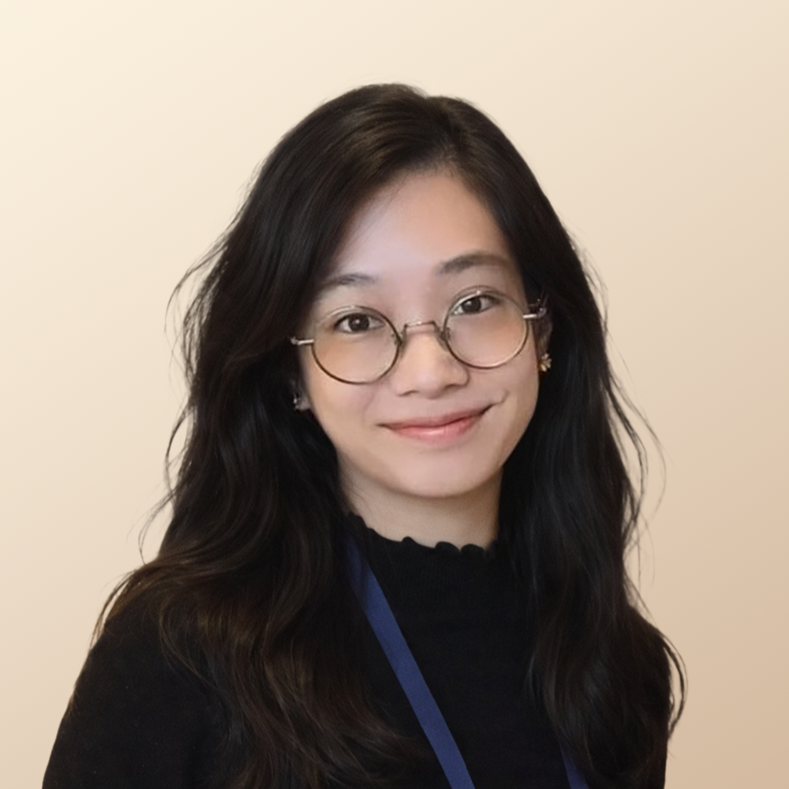

::: {.hero}
# Nicole M. Lee, Ph.D.

[Behavioral neuroscience | Optogenetics | Hardware prototyping | Estimation statistics | Data analysis & visualization]{.tagline}

<!-- 📷 NICOLE: add headshot → images/nicole.jpg (square crop works best) -->
{.headshot width="230"}
:::

I'm a **neuroscientist** and Research Fellow in the **ACC Lab** (Adam Claridge-Chang) at
Duke-NUS Medical School. My PhD advanced **optogenetic methods** for studying neural
circuits in behaviour: building the molecular tools, the instruments, and the statistics
needed to ask how small circuits in the *Drosophila* brain shape what an animal does.

Before the fly work I spent years on cell-division and cell-fusion biology, cancer
drug-resistance, and DNA-repair tools, so I've worked across molecules, microscopes, and
behaviour.

[]{.section-rule}

[What I do]{.eyebrow}

::: {.triptych}
### The molecules
Validating light-driven actuators to switch neurons on and off (kalium
channelrhodopsins, opto-GPCRs), and the experiments that prove they work.

### The machines
Designing the rigs that deliver the light and capture behaviour: arenas, illumination,
and high-throughput tracking pipelines. *(Built in collaboration with an engineer.)*

### The math
Effect-size estimation over p-values, plus the computer-vision and analysis that turn
video into behavioural metrics.
:::
